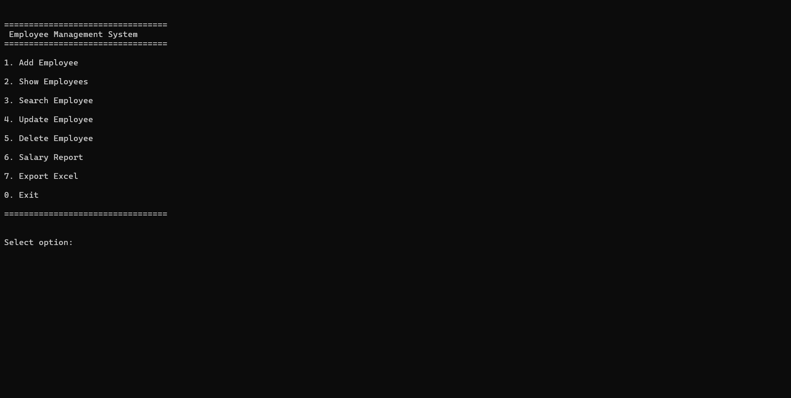

# 👨‍💼 Employee Management System

A modular command-line **Employee Management and Payroll System** built with **Python**.

The application allows users to manage employee records, calculate payroll, generate salary reports, and export employee data to Microsoft Excel. Employee information is stored in a CSV file, making the project lightweight, portable, and easy to run without requiring a database.

---

## 📷 Preview



---

## ✨ Features

* ✅ Add new employees
* ✅ View all employees
* ✅ Search employees by Employee ID
* ✅ Update employee information
* ✅ Delete employee records
* ✅ Automatic payroll calculations
* ✅ Salary report generation
* ✅ Export employee data to Excel (`.xlsx`)
* ✅ CSV-based persistent storage
* ✅ Input validation
* ✅ Exception handling
* ✅ Standalone executable using PyInstaller

---

## 🛠 Technologies Used

| Technology                 | Purpose                         |
| -------------------------- | ------------------------------- |
| Python 3                   | Main programming language       |
| CSV                        | Employee data storage           |
| OpenPyXL                   | Excel export                    |
| Decimal                    | Accurate financial calculations |
| `datetime.timedelta`       | Overtime calculations           |
| Regular Expressions (`re`) | Email validation                |
| PyInstaller                | Build standalone executable     |
| Ruff                       | Code formatting and linting     |

---

## 🧠 Python Concepts Demonstrated

* Object-Oriented Programming (OOP)
* Modular Programming
* File Handling (CSV)
* Excel File Generation
* Properties (`@property`)
* Type Hints
* Exception Handling
* Context Managers (`with`)
* Generator Expressions
* List Comprehensions
* Lambda Expressions
* Input Validation
* Financial Calculations using `Decimal`

---

## 📂 Project Structure

```text
employee-management/
│
├── employee.py
├── excel_export.py
├── file_manager.py
├── main.py
├── report.py
├── validators.py
│
├── employees.csv
├── employees.xlsx
│
├── screenshots/
│   └── menu.png
│
├── dist/
│   └── EmployeeManagement.exe
│
├── requirements.txt
├── developer_notes.md
└── README.md
```

---

## 🚀 Installation

Clone the repository:

```bash
git clone https://github.com/alireza-mousavi-ai/employee-management.git
```

Navigate to the project directory:

```bash
cd employee-management
```

Install the required dependency:

```bash
pip install -r requirements.txt
```

---

## ▶ Usage

Run the application using:

```bash
python main.py
```

After launching the program, an interactive menu allows you to:

* Add employees
* View employee records
* Search employees by Employee ID
* Update employee information
* Delete employee records
* Generate salary reports
* Export employee data to Excel

---
## 📊 Salary Report

The application automatically generates a comprehensive payroll report based on employee data.

The report includes:

* Total number of employees
* Total base salary
* Total overtime payment
* Total fines
* Total gross salary
* Total net salary
* Average net salary
* Employee with the highest net salary
* Employee with the lowest net salary
* Detailed salary information for every employee

All financial calculations are performed using Python's `Decimal` type to ensure accurate monetary calculations.

---

## 📁 Excel Export

Employee records can be exported to a Microsoft Excel workbook using **OpenPyXL**.

The generated `employees.xlsx` file contains:

* Employee information
* Contact details
* Position
* Base salary
* Overtime
* Overtime rate
* Overtime payment
* Fine
* Gross salary
* Net salary

This makes it easy to review, archive, print, or further analyze employee data using spreadsheet software.

---

## 📄 Requirements

Install project dependencies using:

```bash
pip install -r requirements.txt
```

Current dependency:

```text
openpyxl
```

---

## 🧪 Sample Data

The repository includes sample data files for demonstration and testing purposes.

* `employees.csv`
* `employees.xlsx`

These files contain **sample employee records only** and do not include any real or sensitive personal information.

---

## ✔ Tested Functionality

The application has been tested using multiple employee records and different usage scenarios.

Verified features include:

* Employee creation
* Employee search
* Employee update
* Employee deletion
* CSV read/write operations
* Payroll calculations
* Salary report generation
* Excel export
* Input validation
* Invalid menu option handling
* Exception handling
* Standalone executable

---

## 👨‍💻 Author

**Alireza Mousavi**

Electrical Engineering Graduate

Python Developer

GitHub: https://github.com/alireza-mousavi-ai

---

## 📄 License

This project is licensed under the **MIT License**.

You are free to use, modify, and distribute this project under the terms of the license.

---

## ⭐ Support

If you found this project useful, consider giving the repository a **⭐ Star** on GitHub.

Feedback and suggestions are always welcome.
